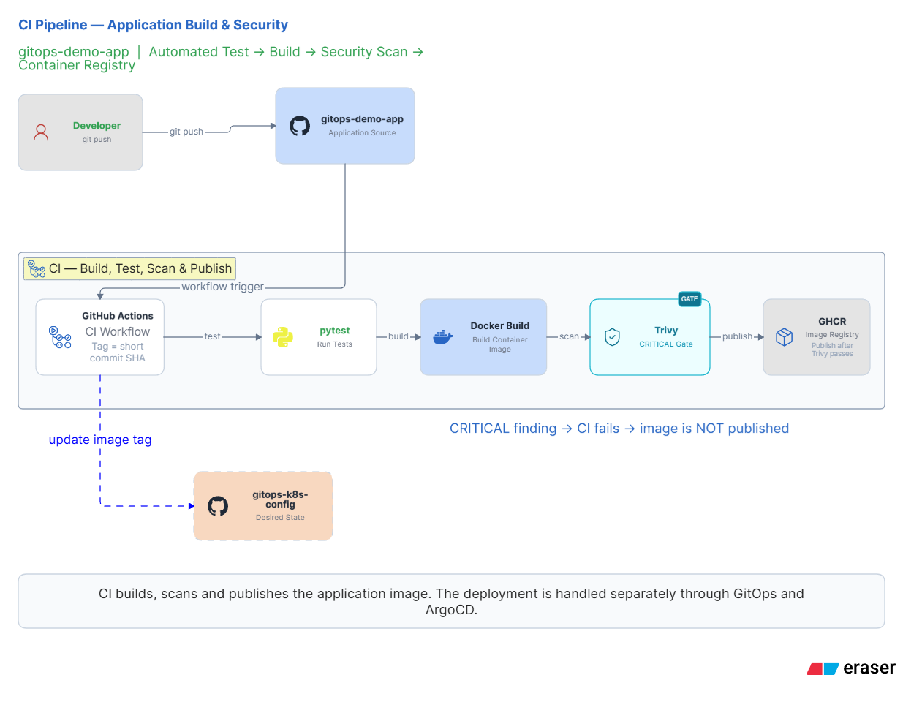
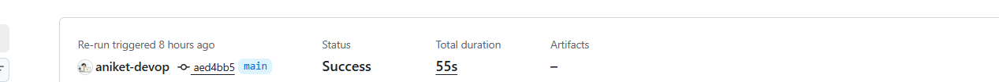
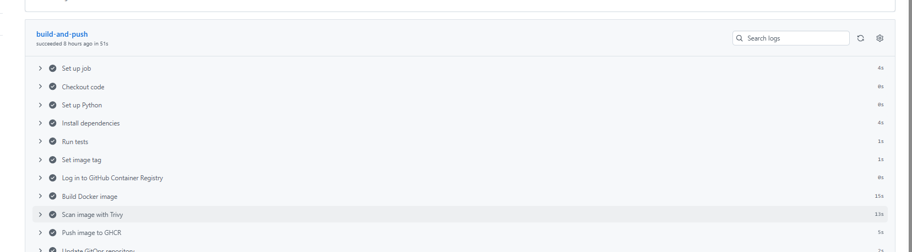

# gitops-demo-app

FastAPI application source and CI pipeline — half of a two-repository GitOps CI/CD project.

I designed, built, and validated this application repository and its CI pipeline, including the cross-repository handoff into the GitOps configuration repo. This repo owns the application and the build/test/scan/publish pipeline; it never touches a Kubernetes cluster.

**GitOps configuration repository:** [`gitops-k8s-config`](https://github.com/aniket-devop/gitops-k8s-config) — Helm chart, environment values, and the ArgoCD `Application` that deploys this app to a Kind cluster. Architecture diagrams, ArgoCD screenshots, and rollback evidence live there.

**At a glance**

| | |
|---|---|
| What I built | A FastAPI app + a GitHub Actions CI pipeline that tests, scans, and publishes it |
| What I own | Application code, tests, Dockerfile, and the full CI workflow, including the handoff into the GitOps repo |
| Where CI stops | A Git commit to `gitops-k8s-config` — no cluster access from this repo, ever |
| Stack | FastAPI · pytest · Docker · GitHub Actions · Trivy · GHCR |

---

## Two-Repository Architecture

```
gitops-demo-app (this repo)          gitops-k8s-config
─────────────────────────            ──────────────────────
FastAPI source                       Helm chart
tests/                                environments/dev, staging
Dockerfile                            ArgoCD Application
CI workflow (build → scan → push)  →  (CI commits new image tag here)
```

| Repo | Owns | Role |
|---|---|---|
| `gitops-demo-app` (this repo) | FastAPI source, tests, Dockerfile, CI workflow | Builds, tests, scans, and publishes a container image |
| [`gitops-k8s-config`](https://github.com/aniket-devop/gitops-k8s-config) | Helm chart, environment values, ArgoCD `Application` | Desired cluster state — watched and reconciled by ArgoCD |

**GitHub Actions does not deploy to Kubernetes.** This repo's CI stops at committing an updated image tag to `gitops-k8s-config`. From there, ArgoCD — running independently and watching that repo — reconciles the cluster. No `kubectl`, no Helm CLI, and no cluster credentials exist anywhere in this repo or its workflow.

**Why split the repos:** it keeps cluster credentials out of the application codebase entirely. This repo's CI can build, test, scan, and publish an image, but has no way to change what's actually running in the cluster — that's a separate, auditable step owned by a different repo and a different credential.

---

## What This App Does

A minimal FastAPI service with three endpoints:

| Endpoint | Purpose | Example response |
|---|---|---|
| `GET /health` | Liveness/readiness check | `{"status": "ok"}` |
| `GET /version` | Current app version | `{"version": "2.0.0", "message": "..."}` |
| `GET /` | Service status | `{"service": "gitops-demo-app", "status": "running"}` |

The application logic is intentionally minimal — the focus of this project is the pipeline and the repo boundary around it.

### Tests

`tests/test_main.py` covers all three endpoints with `fastapi.testclient.TestClient` — status codes and response bodies. `pytest` runs as the first gate in CI; a failing test blocks the build entirely, so nothing gets containerized or scanned from a broken commit.

---

## CI Pipeline



On every push to `main`, `.github/workflows/ci.yml` runs:

```
checkout → pytest → derive commit-SHA image tag → docker build
   → Trivy CRITICAL scan → push to GHCR → update dev tag in gitops-k8s-config
```

| Step | Action | Failure behavior |
|---|---|---|
| 1 | Checkout, set up Python 3.12, install `requirements.txt` | — |
| 2 | Run `pytest` | Failing test blocks everything downstream |
| 3 | Derive image tag from short commit SHA | Every published image traces back to an exact commit |
| 4 | Build the Docker image | — |
| 5 | Scan with Trivy (`severity: CRITICAL`, `exit-code: "1"`) | CRITICAL finding fails the job before the image reaches GHCR |
| 6 | Push to GHCR (`ghcr.io/aniket-devop/gitops-demo`) | Only reached if the scan passes |
| 7 | Clone `gitops-k8s-config` with a separately scoped token, update `environments/dev/values-dev.yaml`, commit as `github-actions[bot]`, push | — |

Step 7 is a plain Git commit to another repository — nothing more. ArgoCD picks up that change on its own watch cycle; the reconciliation flow itself is documented in the [`gitops-k8s-config` README](https://github.com/aniket-devop/gitops-k8s-config).

### Decisions behind the pipeline

- **Why GHCR:** it's already authenticated through the existing `GITHUB_TOKEN`, so there's no separate registry account to manage, and the image lives next to the repo that builds it.
- **Why Trivy:** it's a single Action step that gives a hard pass/fail gate rather than an informational report — easy to enforce, easy to reason about.
- **Why CRITICAL-only gating:** it stops anything severe from reaching GHCR without blocking the pipeline on HIGH/MEDIUM findings that don't represent immediate risk — a deliberate tradeoff for this project's scope, not a claim that lower severities don't matter.

---

## Repository Structure

```
gitops-demo-app/
├── .github/workflows/     # ci.yml — the pipeline described above
├── app/                   # FastAPI source
├── tests/                 # pytest suite covering all three endpoints
├── Dockerfile
├── requirements.txt
├── .dockerignore
└── .gitignore
```

**Tech stack:** FastAPI · pytest · Docker · GitHub Actions · Trivy · GHCR

**Pinned dependencies** (`requirements.txt`): `fastapi==0.115.0`, `uvicorn[standard]==0.30.6`, `pytest==8.3.3`, `httpx==0.27.2`

---

## Security

- **Non-root container** — the Dockerfile creates and switches to an unprivileged user (`adduser -D appuser && chown -R appuser:appuser /app`, `USER appuser`) before the app runs
- **Minimal base image** — `python:3.12-alpine`
- **Trivy CRITICAL gate** — hard-fails (`exit-code: "1"`) before any image reaches GHCR
- **Separated credentials** — GHCR auth uses `GITHUB_TOKEN`; the cross-repo commit to `gitops-k8s-config` uses a distinct, separately scoped `GITOPS_REPO_TOKEN`

Not implemented in this repo: image signing, SAST/dependency scanning beyond the Trivy image scan, and branch-protection or PR-gated checks ahead of `main`.

---

## Engineering Principles Behind This Repo

- **Fail fast, in order** — tests run before the image is even built, so a broken commit never reaches the scan step or the registry.
- **One-way trust boundary** — this repo can publish an artifact; it cannot decide what runs in the cluster. That decision lives entirely in `gitops-k8s-config`.
- **Every image is traceable** — tags are commit SHAs, not `latest` or arbitrary version strings, so any running image maps back to exact source.

---

## Validation / Evidence

- CI workflow (`.github/workflows/ci.yml`) enforces test → scan → push, in that order, with the scan step (`exit-code: "1"`) able to block the push
- Published image tags in GHCR are short commit SHAs, directly traceable to commits in this repo
- The image tag committed to `gitops-k8s-config`'s `environments/dev/values-dev.yaml` matches this repo's corresponding commit SHA





A real GitHub Actions run for this workflow (commit `aed4bb5`, completed in 55s) — every step, from test through Trivy scan, GHCR push, and the GitOps repo update, completing successfully.

Deployment behavior, ArgoCD sync status, and rollback evidence are validated and documented in [`gitops-k8s-config`](https://github.com/aniket-devop/gitops-k8s-config) — not duplicated here.

---

## Limitations

- CI updates only the `dev` environment's image tag; `staging` exists in `gitops-k8s-config` but is not part of the automated promotion path
- This repository does not deploy to Kubernetes under any circumstance — deployment is entirely ArgoCD's responsibility, in the other repo
- No image signing or SAST/dependency scanning beyond the Trivy CRITICAL image scan
- No PR-based checks — the pipeline runs on push to `main`, not on pull requests

---

## Running Locally

**Prerequisites:** Python 3.12, or Docker.

```bash
pip install -r requirements.txt
uvicorn app.main:app --host 0.0.0.0 --port 8000
```

Or via Docker:

```bash
docker build -t gitops-demo .
docker run -p 8000:8000 gitops-demo
```

Verify it's up:

```bash
curl http://localhost:8000/health
# {"status": "ok"}
```

---

## What This Repo Is Not

- Not a production application — it's a demonstration of GitOps CI/CD mechanics
- Not where deployment happens — no `kubectl`, no Helm, no ArgoCD config lives here
- Not tied to any cloud provider — the image is built here; where and how it's deployed is entirely defined in `gitops-k8s-config`

For architecture diagrams, the ArgoCD configuration, the Helm chart, and rollback evidence, see [`gitops-k8s-config`](https://github.com/aniket-devop/gitops-k8s-config).
