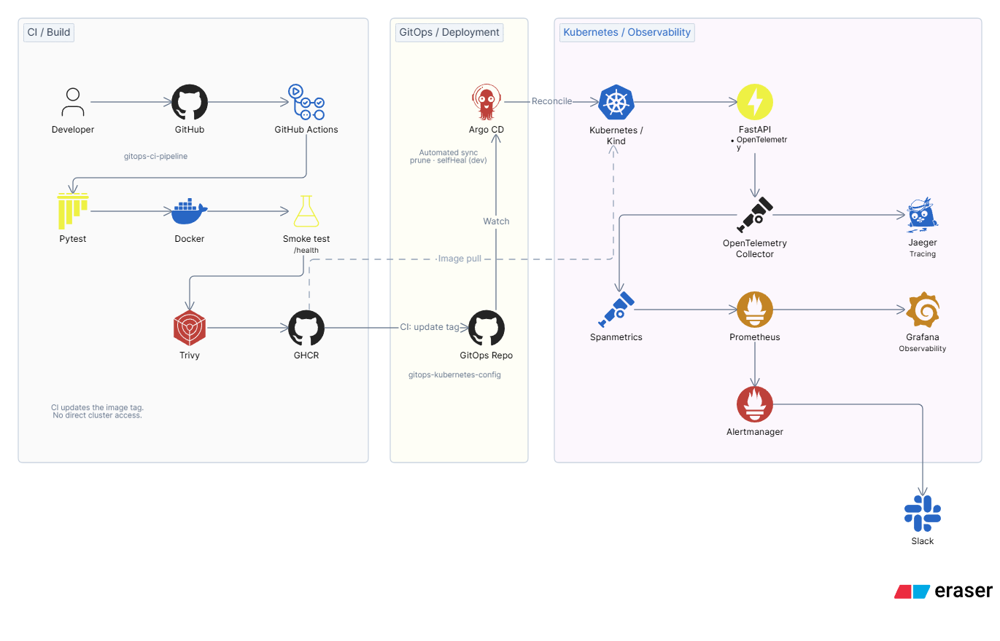
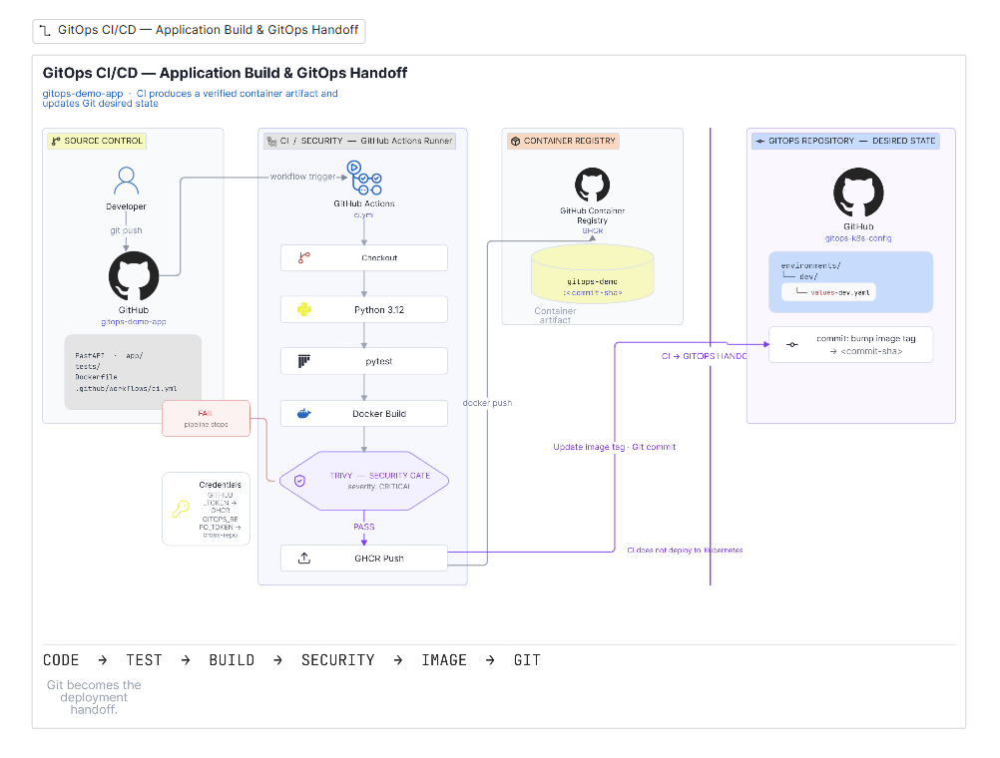
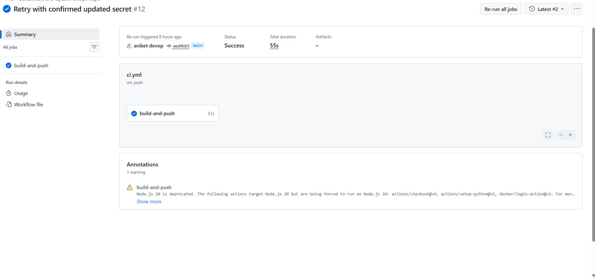
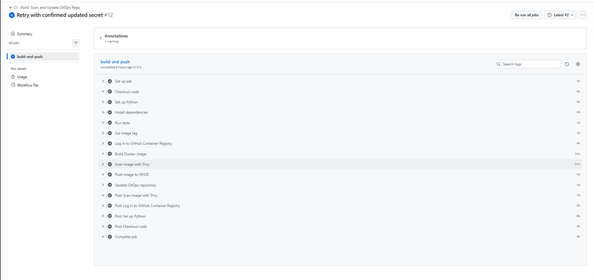

<h1 align="center">gitops-ci-pipeline</h1>

<p align="center">
  <b>CI/CD and GitOps delivery of a FastAPI service to Kubernetes, with tracing, metrics and alerting.</b><br>
  A hands-on DevOps portfolio project: GitHub Actions builds, tests, scans and publishes. Argo CD deploys.
</p>

<p align="center">
  <a href="https://github.com/aniket-devop/gitops-ci-pipeline/actions/workflows/ci.yml"></a>
  
  
  
  
  
</p>

```text
Code  →  Test  →  Build  →  Smoke test  →  Scan  →  Publish  →  Git commit  →  Argo CD  →  Kubernetes  →  Observe
```

> **Scope:** a personal project running on a local Kind cluster. It is not a production or cloud deployment, and it makes no uptime, scale or performance claims.

## Contents

[At a Glance](#at-a-glance) · [Why I Built This](#why-i-built-this) · [Architecture](#architecture) · [End-to-End Workflow](#end-to-end-workflow) · [CI Pipeline](#ci-pipeline) · [GitOps / CD](#gitops--cd) · [Kubernetes](#kubernetes) · [Security](#security) · [Observability](#observability) · [Rollback](#rollback) · [Repository Structure](#repository-structure) · [Tech Stack](#tech-stack) · [How to Run](#how-to-run) · [What This Project Demonstrates](#what-this-project-demonstrates) · [Limitations](#limitations) · [Project Highlights](#project-highlights)

## At a Glance

| | |
|---|---|
| **What it is** | A two-repository GitOps pipeline: app and CI here, desired cluster state in [`gitops-kubernetes-config`](https://github.com/aniket-devop/gitops-kubernetes-config) |
| **CI gates** | pytest, container smoke test, Trivy scan (fails on CRITICAL), all before the image is pushed |
| **Deployment** | Argo CD with automated sync, `prune` and `selfHeal`. CI never touches the cluster |
| **Rollback** | `git revert` of an image-tag commit, using the same path as a deployment |
| **Observability** | OpenTelemetry Collector, Jaeger, Prometheus, Grafana, Alertmanager and Slack, all deployed through Argo CD |
| **Runs on** | Local Kind cluster |

## Why I Built This

Many CD setups let CI run `kubectl apply` directly, which puts cluster credentials inside the pipeline and leaves no single record of what should be running. I wanted to build the alternative myself:

- **CI builds and publishes.** It never touches the cluster.
- **Git records desired state.** Deployments and rollbacks are both Git commits.
- **Argo CD is the only component that deploys.** It reconciles the cluster against Git.

I then added tracing, metrics and alerting so the deployed service could be observed, not just deployed.

### Where to look first

| If you want to see | Open |
|---|---|
| The full CI pipeline | [`.github/workflows/ci.yml`](.github/workflows/ci.yml) |
| The hardened container image | [`Dockerfile`](Dockerfile) |
| Argo CD sync policy | [`argocd/application.yaml`](https://github.com/aniket-devop/gitops-kubernetes-config/blob/main/argocd/application.yaml) |
| Deployment, probes, security context | [`helm/gitops-demo/templates/deployment.yaml`](https://github.com/aniket-devop/gitops-kubernetes-config/blob/main/helm/gitops-demo/templates/deployment.yaml) |
| Alert rules and Prometheus config | [`observability/prometheus.yaml`](https://github.com/aniket-devop/gitops-kubernetes-config/blob/main/observability/prometheus.yaml) |
| Span-derived RED metrics | [`observability/otel-collector.yaml`](https://github.com/aniket-devop/gitops-kubernetes-config/blob/main/observability/otel-collector.yaml) |

The project spans two repositories:

| Repository | Role |
|---|---|
| **`gitops-ci-pipeline`** (this repo) | FastAPI app, Dockerfile, tests, and the GitHub Actions workflows. It builds and publishes the image and has no cluster access. |
| [**`gitops-kubernetes-config`**](https://github.com/aniket-devop/gitops-kubernetes-config) | Helm chart, per-environment values, Argo CD `Application`s and observability manifests. It holds the desired cluster state that Argo CD reconciles. |

## Architecture



### CI to GitOps handoff



## End-to-End Workflow

1. A commit is pushed to `main` in this repo.
2. `ci.yml` runs the tests, builds the image, smoke-tests the running container, and scans it with Trivy.
3. If everything passes, the image is pushed to **GHCR** as `ghcr.io/aniket-devop/gitops-demo:<short-commit-SHA>`.
4. The workflow clones `gitops-kubernetes-config`, updates the image tag in `environments/dev/values-dev.yaml`, and pushes the commit as `github-actions[bot]`. **The pipeline stops here.**
5. Argo CD's `gitops-demo-dev` Application detects the change, renders the Helm chart with the dev values, and syncs the `gitops-demo-dev` namespace.
6. Kubernetes pulls the new image tag from GHCR and rolls out the Deployment.
7. The app emits traces to the OpenTelemetry Collector. The Collector feeds Jaeger and derives request, error and latency metrics for Prometheus, Grafana and alerting.

## CI Pipeline

Defined in `.github/workflows/ci.yml`, triggered on push to `main`:

| Stage | What it does | Why it exists |
|---|---|---|
| Install + **pytest** | Runs 3 tests covering `/health`, `/version` and `/` | Fail fast: a broken commit is never built |
| Image tag | Short commit SHA via `git rev-parse --short HEAD` | Every image maps to an exact commit; no `latest` |
| Docker build | Builds from `python:3.12-alpine` | Produces the artifact that will be deployed |
| **Smoke test** | Runs the built container and polls `/health` (10 tries, 2s apart) | pytest tests code in-process; this checks the real image actually serves traffic |
| **Trivy scan** | `severity: CRITICAL`, `exit-code: "1"` | A CRITICAL finding fails the job before the image reaches the registry |
| Push to GHCR | `docker push` of the SHA-tagged image | Only reached if all earlier stages pass |
| GitOps update | `sed` the tag in `values-dev.yaml`, commit, push to the config repo | Hands the new version to the GitOps layer without touching the cluster |

Other pipeline details:

- **Concurrency control:** the `ci-${{ github.ref }}` group with `cancel-in-progress: false` serializes runs, so two runs don't push to the config repo at the same time.
- **Least-privilege permissions:** `contents: read` and `packages: write` only.
- **Pull requests:** `pr-checks.yml` runs `pytest` only, with read-only permissions and no secrets. Build, scan, push and GitOps update run only on `main`.





## GitOps / CD

The config repo holds everything Argo CD manages. Three `Application` manifests live in `argocd/`:

| Application | Source path | Sync policy |
|---|---|---|
| `gitops-demo-dev` | `helm/gitops-demo` + `environments/dev/values-dev.yaml` | **Automated**, `prune: true`, `selfHeal: true` |
| `observability` | `observability/` (plain manifests) | **Automated**, `prune: true`, `selfHeal: true` |
| `gitops-demo-staging` | `helm/gitops-demo` + `environments/staging/values-staging.yaml` | Manual sync (not automated) |

- **Deployment on Git change:** committing a new tag to `values-dev.yaml` is the only action needed to deploy.
- **Drift correction:** with `selfHeal`, manual cluster changes are reverted to match Git. I tested this by running `kubectl scale ... --replicas=5` on the dev Deployment and watching the extra Pods terminate back to the Git-defined count (screenshot in the config repo).
- **Separate observability Application:** it reconciles independently of the app.
- **Staging:** it uses a static tag and has no promotion path from dev.

## Kubernetes

The Helm chart `gitops-demo` (chart `0.2.0`, appVersion `2.0.0`) renders a Deployment and a `ClusterIP` Service (port 80 → container port 8000).

- **Replicas:** `dev` runs 1 replica and `staging` runs 2. The base chart default is 3, and environment files override only `replicaCount` and `image`.
- **Probes:** liveness and readiness both check `/health`. Liveness starts after 5s and runs every 10s. Readiness starts after 3s and runs every 5s.
- **Resources:** requests of `100m` CPU / `128Mi` memory, and limits of `250m` CPU / `256Mi` memory.
- **Pod hardening:** `runAsNonRoot`, `allowPrivilegeEscalation: false`, all capabilities dropped, and `readOnlyRootFilesystem: true`.
- **Image pulls:** no `imagePullSecrets` are configured. The GHCR package is public, as documented in the config repo.

## Security

| Where | Control |
|---|---|
| **CI** | Trivy image scan fails the build on CRITICAL findings, **before** the image is pushed. Workflow permissions are minimal, and the PR workflow has no secrets. |
| **Image** | `python:3.12-alpine` base, numeric non-root user (UID 10001), and a `.dockerignore` that keeps tests, docs, screenshots and `.github/` out of the image. |
| **Kubernetes** | Non-root, no privilege escalation, dropped capabilities, read-only root filesystem, and resource limits. |
| **Credentials** | GHCR push uses `GITHUB_TOKEN`. The cross-repo commit uses a separate token stored as a repository secret. **CI holds no cluster credentials.** The Slack webhook is a Kubernetes `Secret` created out-of-band and never committed. |
| **Deployment** | Argo CD `selfHeal` reverts undocumented manual changes. |

**Not implemented:** image signing, SAST, dependency scanning beyond the Trivy image scan, NetworkPolicy, RBAC manifests, and a secrets manager.

## Observability

All components run in the `observability` namespace and are deployed through the `observability` Argo CD Application.

- **Tracing:** the app uses the OpenTelemetry SDK with `FastAPIInstrumentor` (no manual spans) and exports **OTLP/HTTP** to the **OpenTelemetry Collector**. The Collector forwards traces to **Jaeger**.
- **RED metrics:** the Collector's **`spanmetrics` connector** derives request rate, error rate and duration from spans, grouped by HTTP method and status code. **Prometheus** scrapes them from the Collector (`:8889`) and scrapes Jaeger's own metrics (`:14269`).
- **Dashboards:** **Grafana** has its Prometheus datasource and a RED dashboard (request rate, error rate, p95 latency) provisioned from ConfigMaps, so nothing is configured by hand. Jaeger's Monitor tab reads the same Prometheus data.
- **Alerting:** Prometheus evaluates three rules and sends firing alerts to **Alertmanager**, which routes them to **Slack**.

| Alert | Condition |
|---|---|
| `HighErrorRate` | 5xx ratio above 5% for 2m |
| `HighLatency` | p95 above 500 ms for 2m |
| `ServiceUnavailable` | no request rate observed for 2m |

I tested the path end to end by triggering `HighLatency` and confirming that the firing and resolved notifications arrived in Slack. Screenshots of traces, the Grafana dashboard, Prometheus targets and the Slack alert are in the [config repo](https://github.com/aniket-devop/gitops-kubernetes-config).

## Rollback

Rollback is a **Git revert**, using the same path as a deployment:

- `57e6a90`: CI-generated commit setting the dev tag to `978b36d`.
- `9f75968`: `git revert` of that commit, setting the tag back to `6d381aa`.

With automated sync enabled, Argo CD picks up the revert and reconciles the cluster to the previous image. There is no separate rollback tool, and the rollback is recorded in Git history.

Not implemented: progressive delivery (canary or blue/green) or automatic rollback on failed health checks.

## Repository Structure

This repo:

```text
gitops-ci-pipeline/
├── .github/workflows/
│   ├── ci.yml            # test, build, smoke test, scan, push, GitOps update
│   └── pr-checks.yml     # pytest on pull requests
├── app/main.py           # FastAPI app + OpenTelemetry setup
├── tests/test_main.py    # endpoint tests
├── screenshots/          # architecture diagrams and CI run evidence
├── Dockerfile            # python:3.12-alpine, non-root
├── requirements.txt      # pinned dependencies
└── .dockerignore
```

[`gitops-kubernetes-config`](https://github.com/aniket-devop/gitops-kubernetes-config):

```text
gitops-kubernetes-config/
├── argocd/               # Applications: dev, staging, observability
├── helm/gitops-demo/     # Chart: Deployment, Service, base values
├── environments/         # dev (CI-managed tag) and staging values
├── observability/        # OTel Collector, Jaeger, Prometheus, Grafana, Alertmanager
└── screenshots/          # Argo CD, tracing, dashboard and alert evidence
```

## Tech Stack

| Category | Technologies |
|---|---|
| **Application** | Python 3.12, **FastAPI**, Uvicorn |
| **Testing** | **pytest**, FastAPI `TestClient` (httpx) |
| **CI/CD** | **GitHub Actions** |
| **Containers** | **Docker**, `python:3.12-alpine`, **GHCR** |
| **Security** | **Trivy** |
| **GitOps** | **Argo CD**, **Helm** |
| **Kubernetes** | **Kind** (local cluster) |
| **Observability** | **OpenTelemetry** (SDK + Collector with `spanmetrics`), **Jaeger**, **Prometheus**, **Grafana**, **Alertmanager**, Slack |

## How to Run

### Application only

Requires Python 3.12 or Docker.

```bash
pip install -r requirements.txt
pytest
uvicorn app.main:app --port 8000
curl http://localhost:8000/health    # {"status":"ok"}
curl http://localhost:8000/version
```

Or with Docker:

```bash
docker build -t gitops-demo .
docker run -p 8000:8000 gitops-demo
```

> The OTLP endpoint is hard-coded to the in-cluster Collector address. Outside the cluster the app works normally, but the exporter logs DNS resolution errors for trace export.

### Full GitOps stack

<details>
<summary><b>Show steps</b></summary>

Prerequisites: Docker, [Kind](https://kind.sigs.k8s.io/), `kubectl`, and Argo CD installed in the cluster. Kind cluster creation and the Argo CD installation are not part of either repo.

```bash
git clone https://github.com/aniket-devop/gitops-kubernetes-config.git
cd gitops-kubernetes-config

# Slack webhook for Alertmanager (never committed; the Alertmanager Pod won't start without it)
kubectl create namespace observability
kubectl create secret generic slack-webhook -n observability --from-literal=url=<YOUR_SLACK_WEBHOOK_URL>

kubectl apply -f argocd/application.yaml
kubectl apply -f argocd/application-observability.yaml
```

Argo CD then deploys the app to `gitops-demo-dev` and the monitoring stack to `observability`. Use `kubectl port-forward` to reach the UIs:

| Service | Namespace | Command |
|---|---|---|
| App | `gitops-demo-dev` | `svc/gitops-demo-svc 8080:80` |
| Jaeger | `observability` | `svc/jaeger 16686:16686` |
| Grafana | `observability` | `svc/grafana 3000:3000` |
| Prometheus | `observability` | `svc/prometheus 9090:9090` |

To see CI drive a deployment end to end, push a commit to `main` here and watch the tag change in `values-dev.yaml` and Argo CD sync it.

To run your own copy, you must fork both repos and update the hard-coded `aniket-devop` references in the Argo CD manifests. You must also add a repository secret named `GITOPS_TOKEN_V2` containing a token with write access to the config repo.

</details>

## What This Project Demonstrates

- **CI/CD automation:** test, build, smoke test, scan, publish and GitOps handoff, with each gate able to stop the pipeline.
- **GitOps deployment model:** Argo CD with automated sync, prune and selfHeal. CI never deploys, and cluster credentials stay out of the pipeline.
- **Container security:** a scan-before-push gate and a non-root image, plus a hardened pod spec.
- **Declarative configuration:** a Helm chart with per-environment values and everything stored in Git.
- **Observability:** distributed tracing, span-derived RED metrics, a provisioned dashboard and Slack alerting.
- **Operations:** Git-based rollback, drift correction, and troubleshooting recorded in the commit history.

## Limitations

- Runs on a **local Kind cluster** only.
- Only `dev` is automated. Staging requires manual sync, uses a static tag, and has no promotion workflow.
- Dev runs a single replica, and there is no HPA, Ingress/TLS, NetworkPolicy or RBAC.
- The observability components are single-replica with no persistent storage configured.
- Argo CD installation and the Slack secret are created out-of-band, not from Git.
- The same `requirements.txt` serves tests and runtime, so test dependencies are in the image.
- The PR workflow runs tests only, and the Trivy scan covers CRITICAL findings only.
- Only the final image is scanned. There is no SAST, dependency scanning or image signing.

## Project Highlights

- **Two-repository GitOps boundary:** the CI pipeline has no cluster access; its only handoff is a Git commit.
- **Gates before publish:** tests, a container smoke test, and a Trivy CRITICAL scan, all passing before the image is pushed.
- **Traceable artifacts:** every image tag is a commit SHA, and every deployment or rollback is a Git commit.
- **Rollback by `git revert`:** the same reconciliation path handles deploys and rollbacks.
- **Drift correction:** Argo CD `selfHeal` reverted a manual `kubectl scale` back to the Git-defined state.
- **Observability pipeline in Git:** OTel Collector `spanmetrics` feeds Prometheus, a provisioned Grafana dashboard and Alertmanager.
- **Alerting tested end to end:** a deliberately triggered `HighLatency` alert reached Slack, including the resolved notification.
